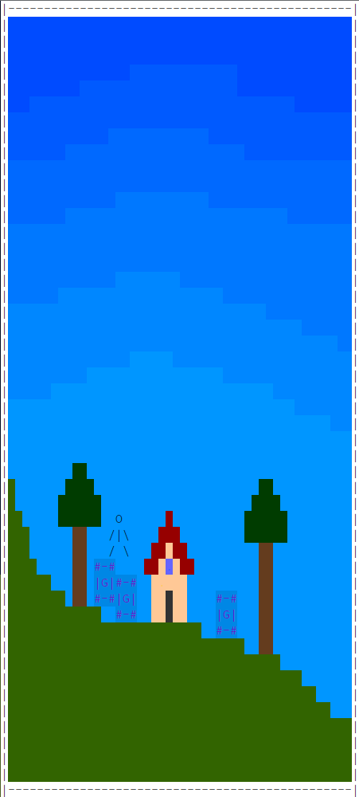

# Hello. I am Kaup, the developer of KTech.

## KTech is my C++ terminal game engine. It is supposed to work like any other basic 2D game engine, but instead of printing its graphics into a graphical window, it prints them into a terminal.

### _In today's world, it is common for new games to release after most of their development resources were invested into their graphics, instead of their game experiences themselves. This phenomenon usually causes such games to not be as good as expected by the players, leading to disappointment among the fan base. KTech solves this issue by implementing old and primitive graphics that are easy to use, look fine and can't become a huge and complex process in the game development._

### KTech is currently capable of:

1. Rendering with layers, opacity, 24 bit color range.
2. Processing collision with event handling, collider types, multiple colliders of different types in a single object, pushing, blocking and overlapping.
3. Playing audio, loading .wav files.
4. Basic GUI (input fields, buttons).
5. Loading from files and using special terminal object textures.
6. Handling input.
7. Handling time.
8. Some other quirks and features.

### At the time of writing (end of May 2023), KTech and its interrelated projects are private. I will hopefully release KTech as open source <ins>somewhen in July 2023</ins>. I am working on making it cross-platform, cleaning the code up, writing a documentation, and adding some extra features.

### More information about KTech:

1. It is very object-oriented.
2. It tries to be easy to use.
3. The game developer (the KTech user) constructs their own game loop with functions that the engine comes with.
4. Important classes: Texture, Object, Camera, Layer, Map, AudioSource, TimePoint.
5. For its own processing (audio, rendering, collision...) it uses only the CPU.
6. It can probably be more optimized and fast, but it is generally resource cheap, especially regarding CPU usage.
7. Game development with KTech can be done completely with a terminal by using a terminal text editor (like Vim), the TextureCreator program and a C++ compiler accessible from a terminal.
8. I started developing KTech in March 2022. I had many breaks, sometimes as long as a month. At the times development was more consistent, it was very slow and usually got a couple of hours per week. Whatsoever, this is the biggest programming project I have ever had.

### This is how a very simple game made with KTech can look:

### Other projects interrelated with KTech:

#### TextureCreator
A program made with KTech for creating KTech texture files. This program is needed for creating KTech textures because each terminal character cell (pixel) has an RGB foreground, RGB background and a character values. This kind of texture can't be created by a normal image creator.

#### ThatGame
A game made with KTech that I am working on alongside KTech itself. In the game the player plays as a gifted hacker that gets hacking and heist jobs from the dark web. It is called "ThatGame" because I haven't yet found a name for it.
