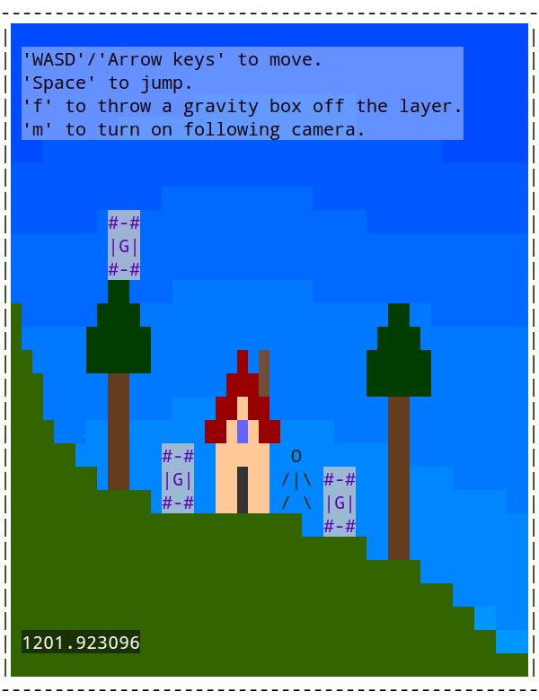
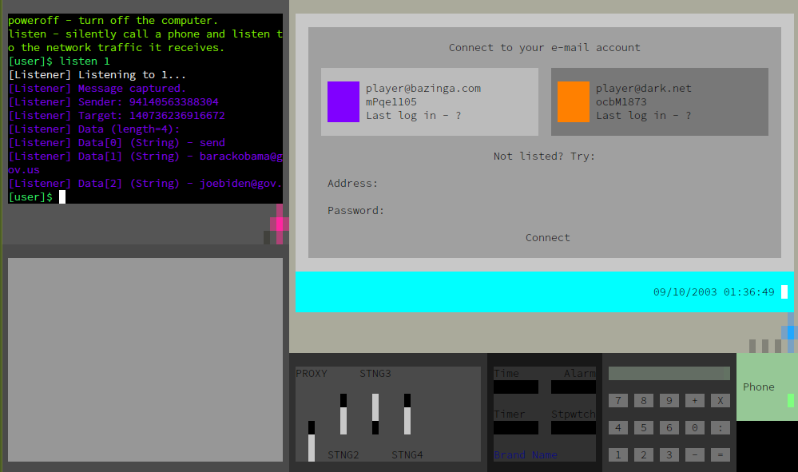
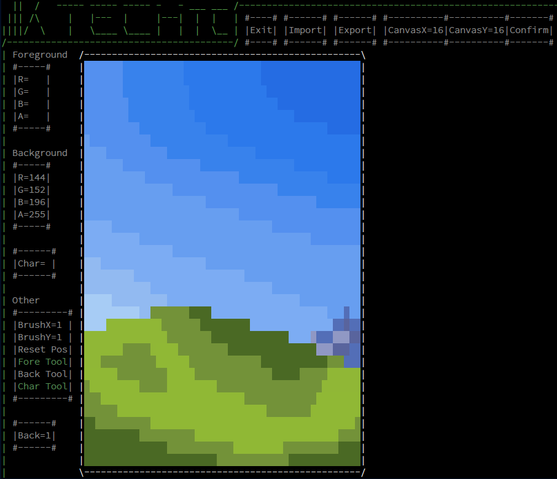

# Kaup

I'm a C++ programmer who focuses on game engines and video games related projects.

I'm the creator and developer of [KTech](#ktech), a 2D terminal game engine library which will be released in the soon future.

I'm also working on a video game called [netset](#netset), which is based on my game engine.

---

## KTech

***KTech*** is Kaup's C++ 2D terminal game engine library.

It is accessible via https://github.com/TheRealKaup/KTech.

---

## netset

A KTech game in active development. In the game the player is a freelance hacker that gets jobs from the darknet. The game involves a networking sandbox, and the player follows a story line rather then receiving randomly generated jobs. The gameplay consists of searching for information, analyzing it and converting it into new information, until the goal is reached.

Here's a screenshot of the game, from 9.10.2023 (d/m/y):

---

## TextureCreator

An application made with KTech for creating KTech texture files. This program is needed for creating KTech textures because each terminal character cell has an RGB foreground, RGB background and a character values. This kind of texture can't be created by a normal pixel-based image creator.

